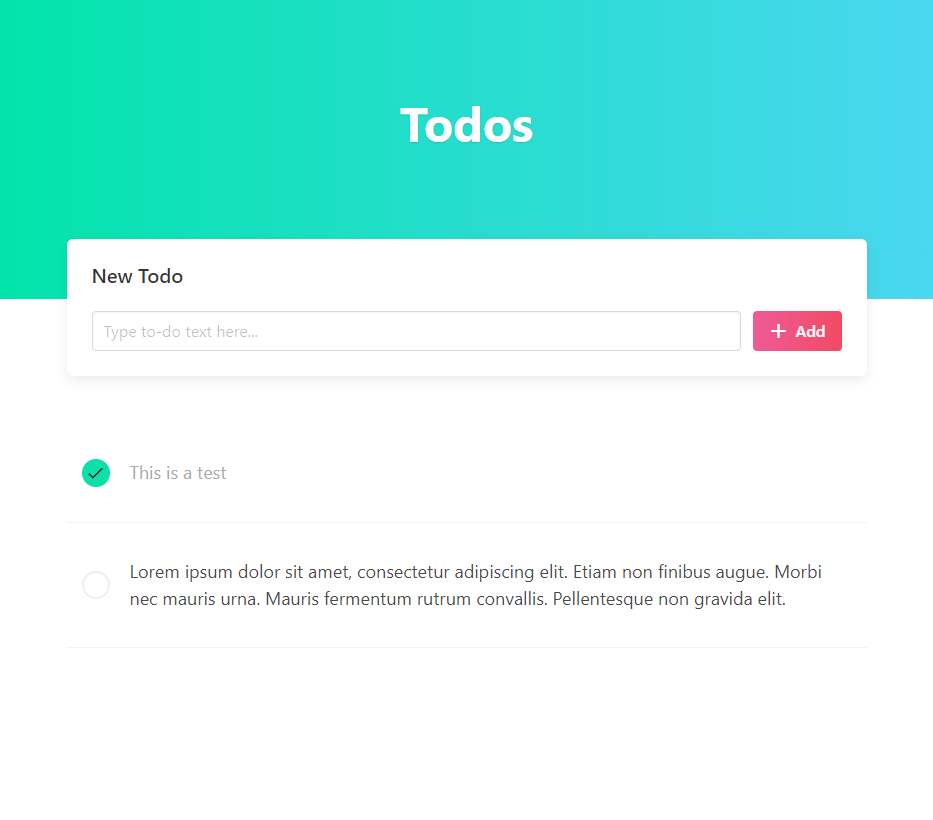

# Kormo - An usual Todo App build on Angular

####So far update:

----

- Initial ui design for todo app
- design added for added todo item
- design added for edit and delete button
- services added for todo list
- get and add functionality added for todo
- added validation on new todo input

----

This project was generated with [Angular CLI](https://github.com/angular/angular-cli) version 13.1.4.

## Development server

Run `ng serve` for a dev server. Navigate to `http://localhost:4200/`. The app will automatically reload if you change any of the source files.

## Build

Run `ng build` to build the project. The build artifacts will be stored in the `dist/` directory.
