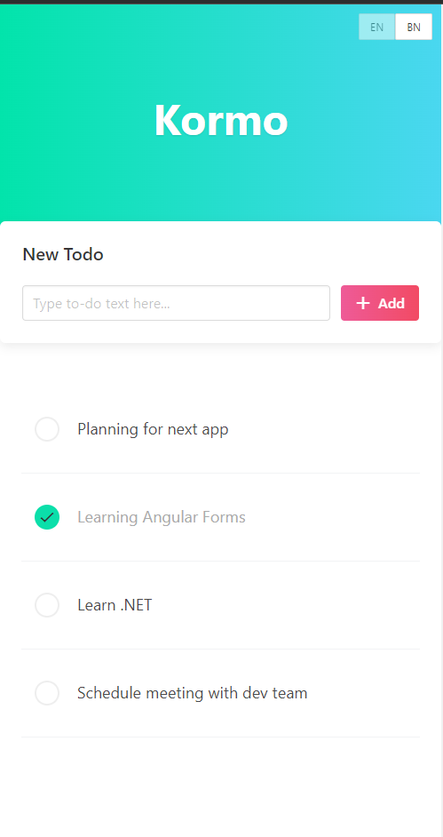
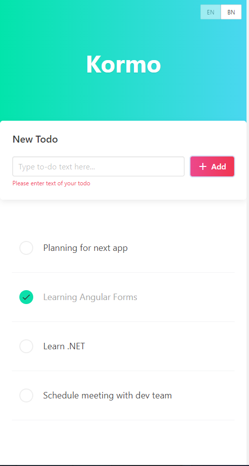
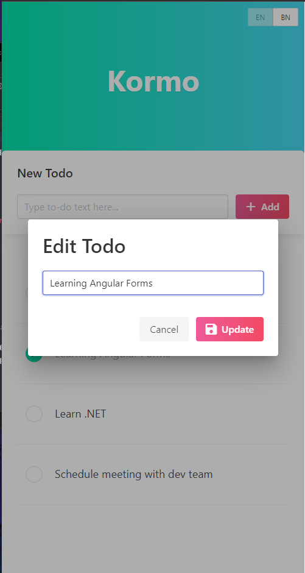
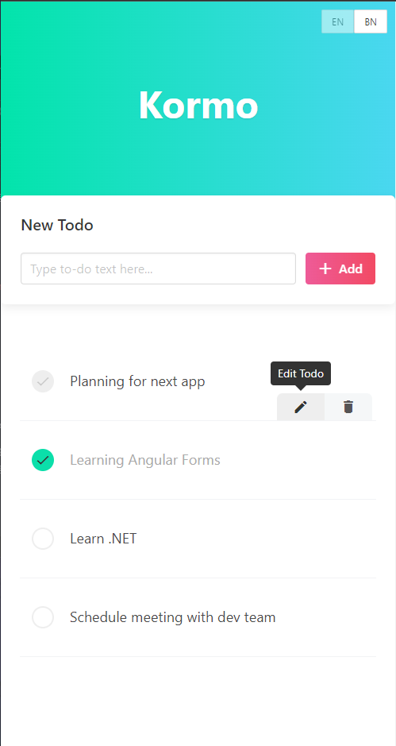
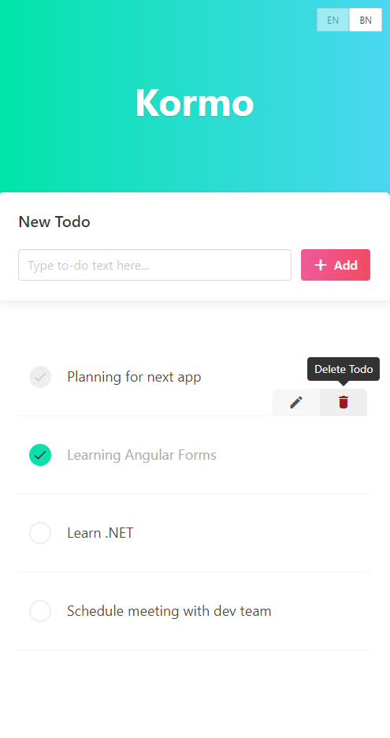
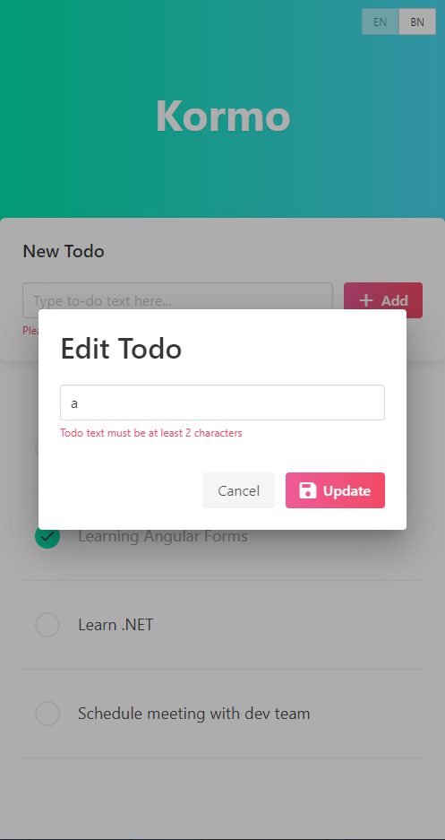
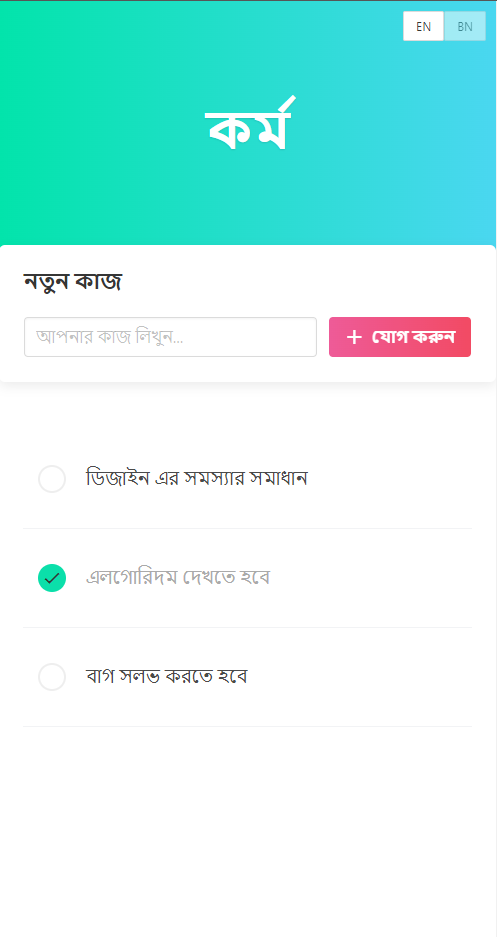
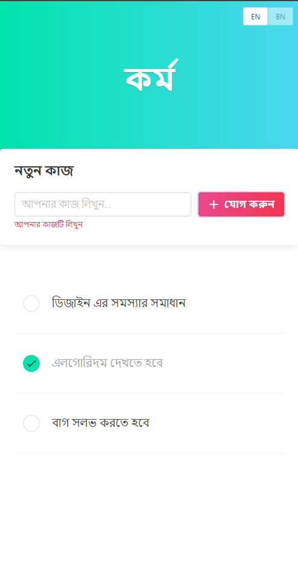
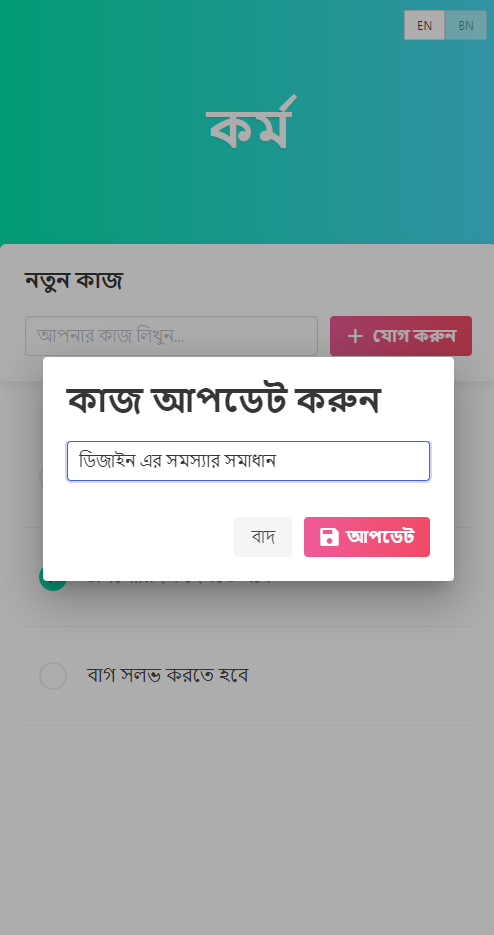
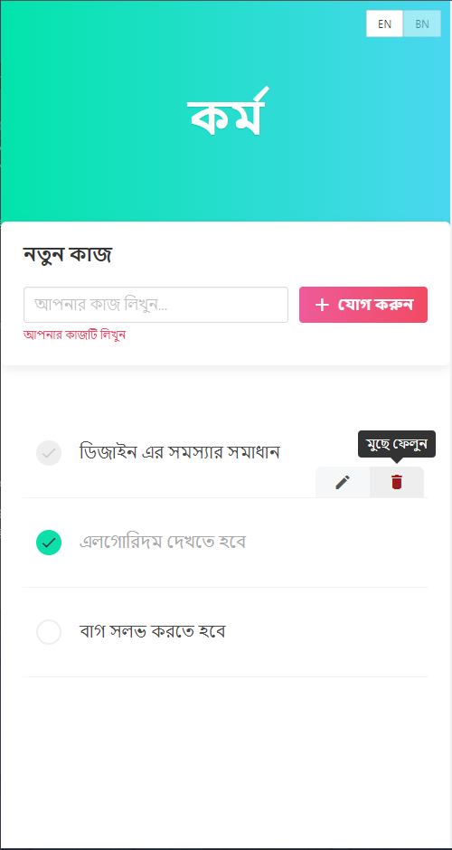

# Kormo - An usual Todo App build on Angular

---

Kormo is an usual todo app which basic features mentioned below. This app is build on Angular 13. We have used Bulma CSS, Material UI, and Material Icon for UI. We have design the coding structure in such a way that it can be extended to a full stack app. We have tried to separate the services and repositories from main component so that it can be extended or changed further in future.

To run the app, 
- first clone the full repository 
- Run `npm i`
- Run `ng serve`
- Navigate to `http://localhost:4200/`
- The app will automatically reload if you change any of the source files.
- Run `ng build` to build the project. The build artifacts will be stored in the `dist/` directory.

The main source code is in `src/app` directory.

## Features

----

- Add, Update, Delete Todo items
- Single page application
- Support for Enlish and Bangla languages
- Validation on input
- Save data on Local Storage

----

#### Screenshots

---

##### English

---

##### Bangla

---

This project was generated with [Angular CLI](https://github.com/angular/angular-cli) version 13.1.4.
